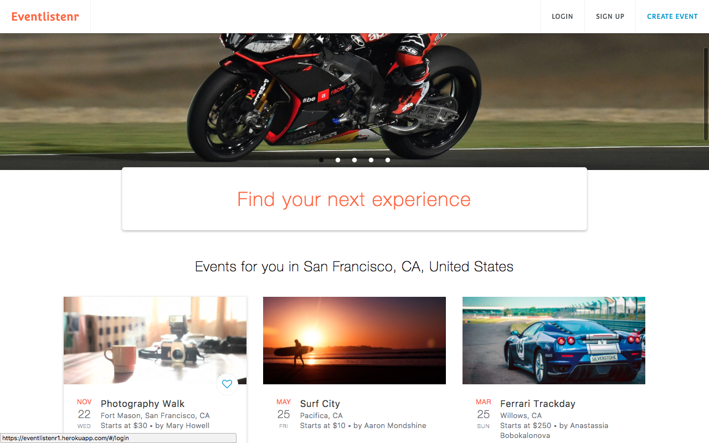
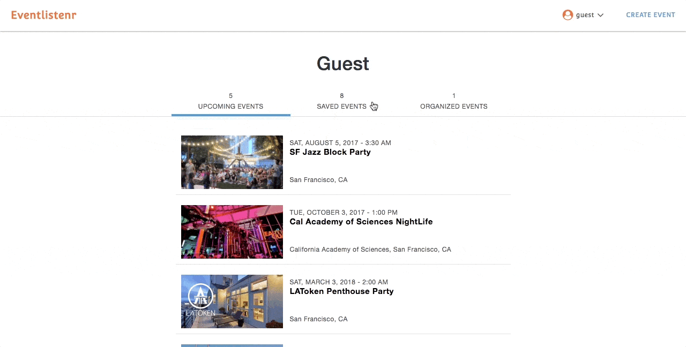

# Eventlistenr

[](https://github.com/rspec/rspec-rails)


Eventlistenr is a single-page web application inspired by Eventbrite. This event technology platform enables users to securely login/signup to accounts, host, bookmark, and register to events. Check it out! [Eventlistenr Live](https://eventlistenr.herokuapp.com/)

[Eventlistenr Live 2](https://eventlistenr1.herokuapp.com/)


## Technologies
* Ruby on Rails
* PostgreSQL
* React.js with Redux


## Features and Implementation
### User Login/Signup format
* Secure user account authentication by generating and deleting session tokens and password hashing using BCrypt.


* Implement `AuthRoute` to ensure user cannot visit `/#/login` and `/#/signup` if user is already signed in, and a `ProtectedRoute` to redirect user to `/#/login` page if user wants to create, bookmark, or register to an event. Auth and Protected functions are presentational components, so a connect() method provided by React Redux library is used to create a container component to connect these two components to Redux. This allows the use of Auth and ProtectedRoute to be implemented in other React components.

```
const App = () => (
  <div>
    <Switch>
      <ProtectedRoute exact path="/events/new" component={ EventFormContainer } />
      <Route path="/events/:eventId" component={ EventShowContainer } />
      <ProtectedRoute path="/profile" component={ UserProfileContainer } />
      <AuthRoute path="/login" component={ SessionFormContainer } />
      <AuthRoute path="/signup" component={ SessionFormContainer } />
      <Route path="/" component={ HomePage } />
    </Switch>
    <Footer />
  </div>
);
```

Hm, what is ProtectedRoute and AuthRoute???

Well, the following are custom routes created to protect frontend routes. Specifically, this prevents logged in users from accessing the /login or /signup page.

With AuthRoute, if user is loggedIn? then render respective component specified in AuthRoute, else, redirect user to homepage.

Similarly, with ProtectedRoute, if user is loggedIn? then render component with respective props; else, redirect user to login page.

These routes can then be used in the App component as shown in the above code snippet.

```
import React from 'react';
import { connect } from 'react-redux';
import { Route, Redirect, withRouter } from 'react-router-dom';

const Auth = ({ component: Component, path, loggedIn }) => (
  <Route path={path} render={(props) => (
    !loggedIn ? (
      <Component {...props} />
    ) : (
      <Redirect to="/" />
    )
  )} />
);

const Protected = ({ component: Component, path, loggedIn }) => (
  <Route path={path} render={(props) => (
     loggedIn ? (
      <Component {...props} />
    ) : (
      <Redirect to="/login" />
    )
  )} />
);

const mapStateToProps = state => (
  {loggedIn: Boolean(state.session.currentUser)}
);

export const AuthRoute = withRouter(connect(mapStateToProps, null)(Auth));
export const ProtectedRoute = withRouter(connect(mapStateToProps, null)(Protected));
```

### Create Events
* User has the ability to create events. Images can be uploaded via drag and drop feature using React Dropzone. The images are then stored on the cloud using Cloudinary's API, and as a result, returns an image_url to be stored in the database.


* **Technical Challenge: Drag and Drop Implementation:**
I used a client-side HTTP request library called SuperAgent, to create a POST request to Cloudinary, attaching Cloudinary's upload preset and file required to handle the image upload using .field() method. Next, a conditional statement was used to check if the response received was an empty URL. If it wasn't, then the image was uploaded successfully and Cloudinary generated a custom URL.

```
class DropForm extends Component {
  constructor(props) {
    super(props);
    this.state = {
      uploadedFileCloudinaryUrl: '',
    };
  }

  onImageDrop(files) {
    this.setState({
      uploadedFileCloudinaryUrl: files[0],
    });
    this.handleImageUpload(files[0]);
  }

  // for more info: https://css-tricks.com/image-upload-manipulation-react/
  handleImageUpload(file) {
    let upload = request.post(CLOUDINARY_UPLOAD_URL)
                        .field('upload_preset', CLOUDINARY_UPLOAD_PRESET)
                        .field('file', file);

    upload.end((err, response) => {
      if (err) {
        console.error(err);
      }
      if (response.body.secure_url !== '') {
        this.props.updateUrl(response.body.secure_url);
        this.setState({
          uploadedFileCloudinaryUrl: response.body.secure_url,
        });
      }
    });
  }
  ```


* **Technical Challenge: Implementing the eventsReducer**
- Object.freeze() is used to ensure that state is never accidentally mutated (i.e. adding to new properties to object) It renders an object immutable.
- lodash, a JavaScript utility library and npm package is used to provide the merge() helper function, which is a quick and effective way to "deep dup" an object. Object.assign() only performs a "shallow dup" of an object, which can cause issues with deeply nested objects.

```
const nullEvent = Object.freeze({
  events: {},
  errors: []
});

let currentState;

const eventReducer = (state = nullEvent, action) => {
  Object.freeze(state);

  switch(action.type){
    case RECEIVE_ALL_EVENTS:
      const events = action.events;
      return merge({}, state, { events });
    case RECEIVE_EVENT:
      const event = action.event;
      return merge({}, state, { event });
    case REMOVE_EVENT:
    // first dup current state, then find event and delete item.
      currentState = merge({}, state);
      delete currentState[action.event.id];
      return currentState;
    case RECEIVE_EVENT_ERRORS:
      const errors = action.errors;
      return Object.assign({}, state, { errors });
    case CLEAR_EVENT_ERRORS:
      return Object.assign({}, state, { errors: [] });
    default:
      return state;
  }
};
```

### Home Page
* Contains a slider using React Slick to display splash page images. Immediately after EventIndex component is mounted, a fetch request is made for all events, and each event is passed as a prop through the .map() method to render multiple components in EventIndexItem. It is important to add a key prop when passing individual events to its child component because keys enable React to identify which items have changed, added, or removed, which can substantially improve rendering performance when dealing with large numbers of events. For more info, look up React's diffing algorithm and VirtualDOM.




### Event Show Page


* When the EventShow component is mounted, a requestEvent action is dispatched, sending an AJAX request with event_id as the params to retrieve the event from the backend. `ownProps` is then used to access the event id from the params property. The current user was mapped to props to render organizer of that event.

```
import { connect } from 'react-redux';
import { requestEvent } from '../../actions/event_actions';
import EventShow from './event_show';

const mapStateToProps = ({ event, session }, ownProps) => ({
  event: event.events[ownProps.match.params.eventId] || {},
  currentUser: session.currentUser,
});

const mapDispatchToProps = dispatch => ({
  requestEvent: id => dispatch(requestEvent(id))
});

export default connect(mapStateToProps, mapDispatchToProps)(EventShow);
```

### Bookmarking Events
* A handleClick event is defined, where as long as there exists a currentUser, a bookmark instance can be created or deleted. This is done by dispatching the createBookmark or deleteBookmark action, where the event is passed as an argument. If user is not logged in, the user is redirected to the login page via Link tag on the bookmark icon. Bookmarked events are shown on the User Dashboard.

```
bookmarkIcon() {
  const { currentUser } = this.props;

  if ( currentUser.bookmarks.includes(this.props.event.id)) {
    return (
      <i className="fa fa-heart selected" aria-hidden="true"></i>
    );
  } else {
    if (currentUser.id === undefined) {
      return (
        <Link to="/login">
          <i className="fa fa-heart-o unselected" aria-hidden="true"></i>
        </Link>
      );
    } else {
      return (
        <i className="fa fa-heart-o unselected" aria-hidden="true"></i>
      );
    }
  }
}

handleClick() {
  if (this.props.currentUser.id === undefined) {
    return
  } else if (this.props.currentUser.bookmarks.includes(this.props.event.id)) {
    this.props.deleteBookmark(this.props.event.id);
  } else {
    const event = { event_id: this.props.event.id };
    this.props.createBookmark(event);
  }
}
```

### Registering to Events


* When user checkouts after selecting number of tickets, default rendering is first prevented, a ticket object is created, containing the event_id and updated ticket quantity (due to the .handleChange() method). Next, ticket is passed as an argument to the createTicket action and is dispatched. A .then() promise is appended to close the modal if ticket registration is successful. Otherwise, if the user is not logged in, a .catch() promise is appended to redirect user to the login page. Registered events appear on the User Dashboard.

```
handleChange(e) {
  e.preventDefault();
  this.setState({ quantity: parseInt(e.currentTarget.value) });
}

handleSubmit(e) {
  e.preventDefault();
  // console.log("ticket_form handleSubmit props", this.props);

  // create a ticket object before passing to createTicket()
  let ticket = Object.assign({}, this.state);
  ticket.event_id = this.props.event.id;
  this.props.createTicket(ticket)
  .then(() => {
    this.props.closeModal();
    this.props.history.push("/profile");
    })
}
```

### User Dashboard


* Using react router, four additional routes were created to allow user to navigate through registered, bookmarked, and organized event components. By default when user accesses the profile component, the url is redirected to ticketed events component.

```
<Route exact path={'/profile'}
  render={ () => <Redirect to={'/profile/ticketed'} /> }
/>
<Route path={'/profile/ticketed'}
  render={ () => <UpcomingEvents ticketedEvents={ticketedEvents} /> }
/>
<Route path={'/profile/bookmarked'}
  render={ () => <BookmarkedEvents bookmarkedEvents={bookmarkedEvents} /> }
/>
<Route path={'/profile/organized'}
  render={ () => <OrganizedEvents
  organizedEvents={organizedEvents} /> }
/>
```

## Additional Resources
* [View Wireframes](https://github.com/gevuong/EventListenr/tree/master/docs/wireframes)
* [React Component Hierarchy](https://github.com/gevuong/EventListenr/blob/master/docs/component_hierarchy.md)
* [API endpoints](https://github.com/gevuong/EventListenr/blob/master/docs/api-endpoints.md)
* [DB schema](https://github.com/gevuong/EventListenr/blob/master/docs/schema.md)
* [Sample State](https://github.com/gevuong/EventListenr/blob/master/docs/sample-state.md)


## Future Direction
I plan to incorporate additional features to this application, such as the following:
* Add categories
* Created events can be edited and deleted
* Display Google Maps to show event's location on the event show page
Interactive map showing multiple events on search results page
* Autocomplete search feature to search events by category or event name
