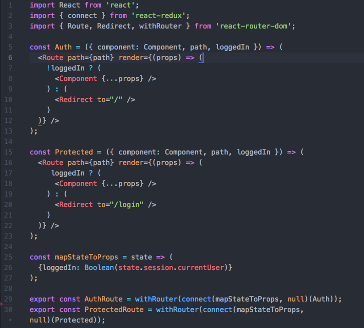
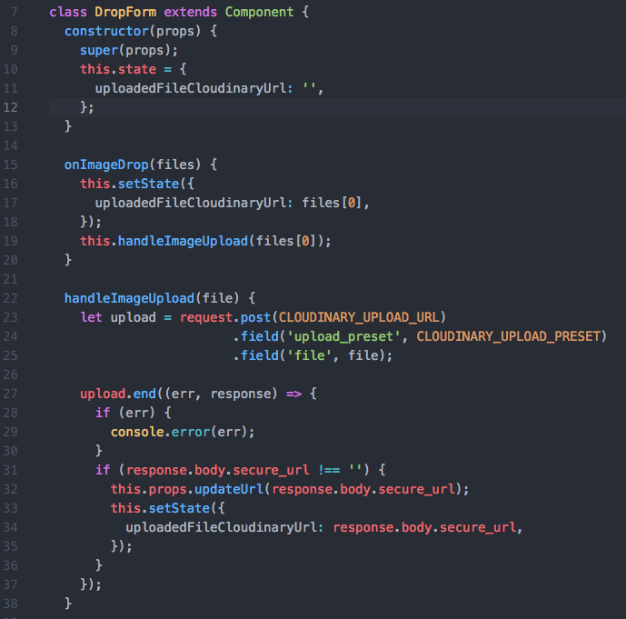
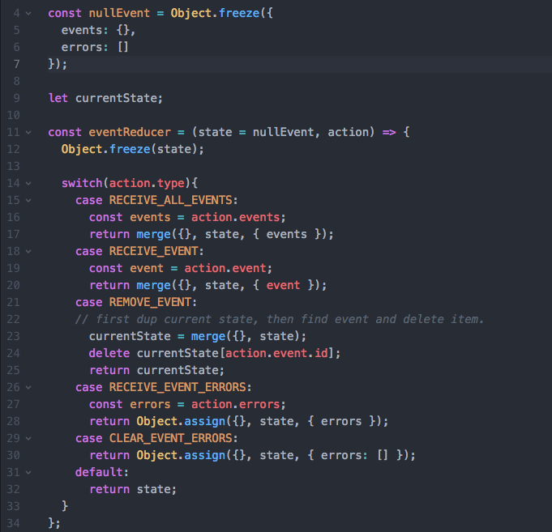
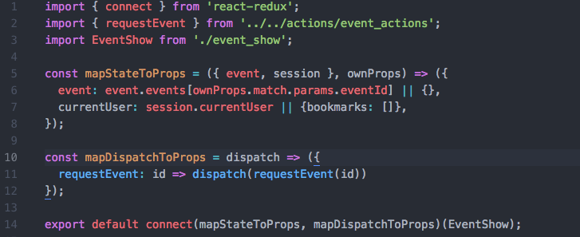
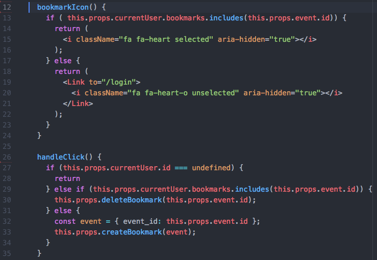
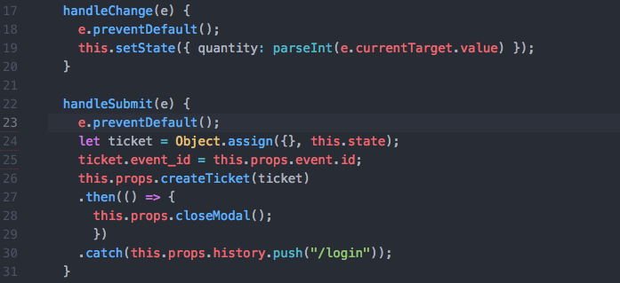
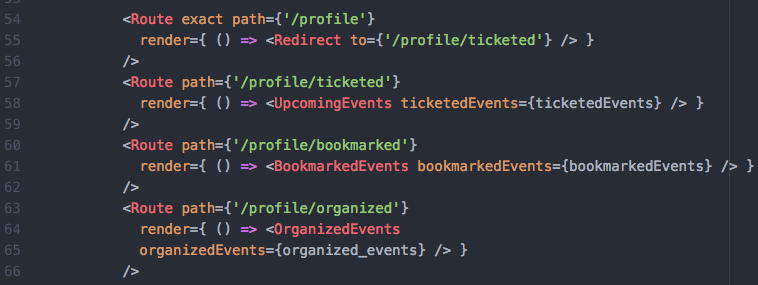

# Eventlistenr

[Eventlistenr Live](https://eventlistenr.herokuapp.com/)

[Eventlistenr Live 2](https://eventlistenr1.herokuapp.com/)

Eventlistenr is a single-page web application inspired by Eventbrite. The platform enables users to create secure accounts, host, bookmark, and register to events.

## Technologies
* Ruby on Rails MVC framework
* PostgreSQL
* React.js with Redux

## Notable Features and Implementation
### User Login/Signup format
* Secure user accounts with front-end user authentication using BCrypt

* Implement `AuthRoute` to ensure user cannot visit `/#/login` and `/#/signup` if user is already signed in, and a `ProtectedRoute` to redirect user to `/#/login` page if user wants to create, bookmark, or register to an event. Auth and Protected functions are presentational components, so a connect() method provided by React Redux library is used to create a container component to connect these two components to Redux. This allows the use of Auth and ProtectedRoute to be implemented in other React components.

### Create Events
* User has the ability to create events. Images can be uploaded via drag and drop feature using React Dropzone.

* **Technical Challenge: Drag and Drop Implementation:**
I used a client-side HTTP request library called SuperAgent, to create a POST request to Cloudinary, attaching Cloudinary's upload preset and file required to handle the image upload using .field() method. Next, a conditional statement was used to check if the response received was an empty URL. If it wasn't, then the image was uploaded successfully and Cloudinary generated a custom URL.

* **Technical Challenge: Implementing the eventsReducer**
- Object.freeze() is used to ensure that state is never accidentally mutated (i.e. adding to new properties to object) It renders an object immutable.
- lodash, a JavaScript utility library and npm package is used to provide the merge() helper function, which is a quick and effective way to "deep dup" an object. Object.assign() only performs a "shallow dup" of an object, which can cause issues with deeply nested objects.

### Home Page
* Contains a slider using React Slick to display splash page images. Immediately after EventIndex component is mounted, a fetch request is made for all events, and each event is passed as a prop through the .map() method to render multiple components in EventIndexItem. It is important to add a key prop when passing individual events to its child component because keys enable React to identify which items have changed, added, or removed, which can substantially improve rendering performance when dealing with large numbers of events.

### Event Show Page

* When the EventShow component is mounted, a requestEvent action is dispatched, sending an AJAX request with event_id is the params to retrieve the event from the backend. `ownProps` is then used to access the event id from the params property. The current user was mapped to props to render organizer of that event.

### Bookmarking Events
* A handleClick event is defined, where as long as there exists a currentUser, a bookmark instance can be created or deleted. This is done by dispatching the createBookmark or deleteBookmark action, where the event is passed as an argument. If user is not logged in, the user is redirected to the login page via Link tag on the bookmark icon. Bookmarked events are shown on the User Dashboard.

### Registering to Events

* When user checkouts after selecting number of tickets, default rendering is first prevented, a ticket object is created, containing the event_id and updated ticket quantity (due to the .handleChange() method). Next, ticket is passed as an argument to the createTicket action and is dispatched. A .then() promise is appended to close the modal if ticket registration is successful. Otherwise, if the user is not logged in, a .catch() promise is appended to redirect user to the login page. Registered events appear on the User Dashboard.

### User Dashboard

* Using react router, four additional routes were created to allow user to navigate through registered, bookmarked, and organized event components. By default when user accesses the profile component, the url is redirected to ticketed events component.

## Additional Resources
* [View Wireframes](https://github.com/gevuong/EventListenr/tree/master/docs/wireframes)
* [React Component Hierarchy](https://github.com/gevuong/EventListenr/blob/master/docs/component_hierarchy.md)
* [API endpoints](https://github.com/gevuong/EventListenr/blob/master/docs/api-endpoints.md)
* [DB schema](https://github.com/gevuong/EventListenr/blob/master/docs/schema.md)
* [Sample State](https://github.com/gevuong/EventListenr/blob/master/docs/sample-state.md)

## Future Direction
I plan to incorporate additional features to this application, such as the following:
* Incorporating categories
* Modifying Created Events
Allow user to edit and delete created event
* Google Maps
Interactive map showing the event's location on the event show page
Interactive map showing multiple events on search results page
* Search
Autocomplete search feature allows users to search for events by category or by event name
